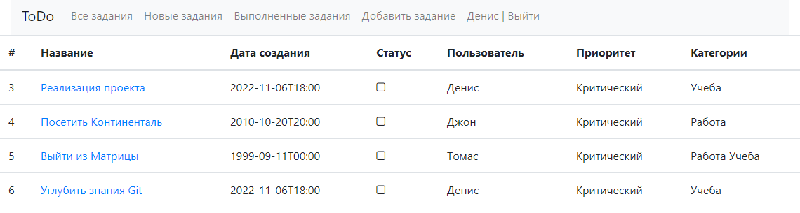
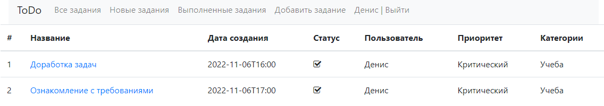
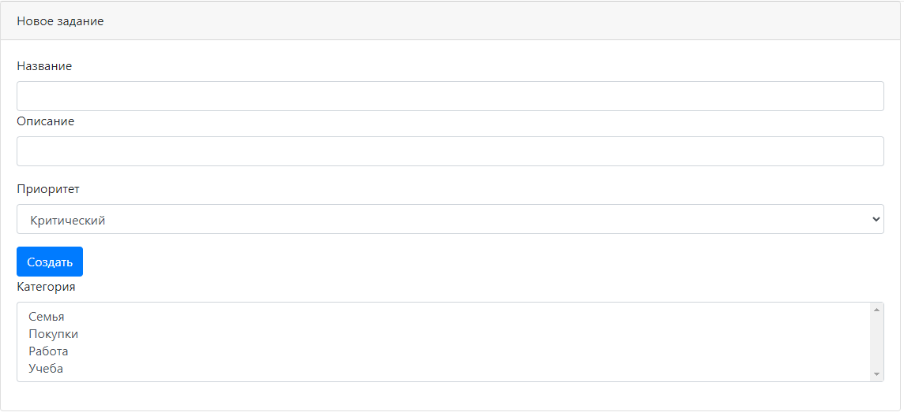
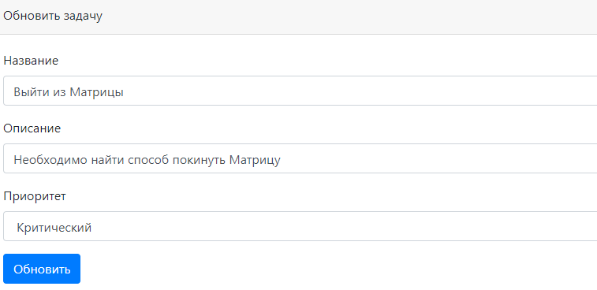
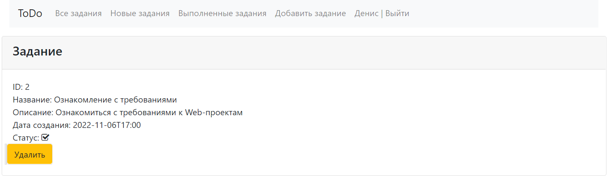

# job4j_todo

## Описание проекта
Данный проект представляет собой реализацию сайта для ведения задач.  
Реализованный функционал:
* 3 списка задач: все задачи, новые задачи, выполненные задачи;
* если задача не выполнена, то её можно отредактировать, отметить выполненной или удалить;
* если задача выполнена, то её можно только удалить;
* если нужно удалить все задачи разом, то для этого предусмотрена кнопка на главной странице списка.

## Стек технологий
* Java 17
* PostgreSQL 14
* Apache Maven 3.8.5
* Spring Boot 2.7.3
* Liquibase 4.15.0
* Hibernate 5.6.11.Final;
* Log4j 1.2.17
* Lombok 1.18.24
* JUnit 5.8.2
* Mockito 4.8.0
* Checkstyle 8.29
* Thymeleaf 3.0.15

## Требуемое окружение для запуска проекта
* Браузер
* JDK 17
* Apache Maven 3.8
* PostgreSQL 14

## Инструкция по запуску проекта
1) Скачать и разархивировать проект
2) В PostgreSQL создать базу данных cinema (url = `jdbc:postgresql://127.0.0.1:5432/todo`)
3) Открыть командную строку и перейти в папку с проектом, например `cd c:\projects\job4j_todo`
4) Выполнить команду `mvn install`
5) Перейти в папку targets командой `cd target`
6) Выполнить команду `java -jar job4j_todo-1.0.jar`
7) Перейти по ссылке `http://localhost:8081/formAllTasks`

## Взаимодействие с приложением

### При открытии сайта попадаем на страницу для авторизации

### Если учетная запись не найдена, то будет выведено сообщение

### Если учетной записи ещё нет, то необходимо зарегистрироваться

### Если регистрация прошла успешно, то будет выведено сообщение

### Если регистрация прошла неуспешно, то будет выведено сообщение

### После успешной аутентификации попадаем на страницу со списком всех задач

### При желании можно посмотреть новые / выполненные задачи отдельными списками
#### Новые задачи

#### Выполненные задачи

### Страница с формой добавления задачи

### Страница с формой редактирования задачи

### Если задача не выполнена, то на странице с подробной информацией 3 кнопки: "Завершить", "Изменить", "Удалить"

### Если задача выполнена, то на странице с подробной информацией только кнопка "Удалить"

## Контакты для связи
&nbsp;&nbsp;
&nbsp;&nbsp;
